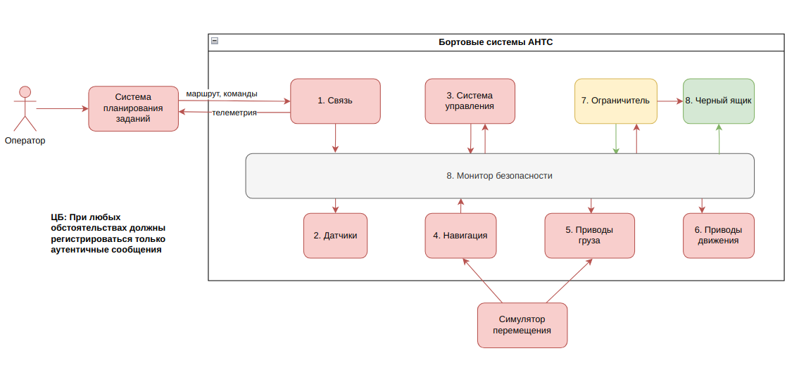

# Отчёт о прогрессе по реализации блока безопасной регистрации  
**Дата:** 19 мая 2025  
**Проект:** Интеграция безопасной регистрации в кибериммунную систему управления автономного транспортного средства  

## Текущий статус  

### Реализованные задачи  

✅ **1. Разработка модуля цифровых подписей**  
   - Создан модуль `crypto.py`, реализующий:  
     - Генерацию RSA-ключей (2048 бит) через `cryptography.hazmat.primitives.asymmetric.rsa`  
     - Детерминированную сериализацию объектов для подписи  
     - Верификацию подписей

✅ **2. Реализация "чёрного ящика" (BlackBox)**  
   - Созданы базовый и реализованный классы:  
     - `BaseBlackBox` (абстрактный) с методом `_log_event`  
     - `BlackBox` с функциональностью:  
       - Логирование событий в файл с маркировкой валидности  

✅ **3. Интеграция с компонентами системы**
   - Передача приватного и публичного ключей доверенным модулям
   - Добавление подписей к исходящим сообщениям  
   - Проверка валидности подписей в BlackBox, учитываем это в логах
   - Логирование событий, связанных с безопасностью

✅ **4. Тестирование безопасности**  
   - Проверка устойчивости к:  
     - Поддельным сообщениям  
     - Повторному использованию сообщений  
     - Повреждённым данным  

✅ **5. Доработка архитектуры системы**  
   - Четкое обознчение ЦБ:  
   - Доработка реализации под ЦБ 

 ✅ **6. Доработка системы**  

## Архитектура системы:

## Инструкция по заупску тестов:
1. Скачать пакет pytest, если таковой отсутствует:
  sudo apt install pytest
  или
  pip install pytest
2. Запустить тесты:
  python3 -m pytest -v tests/test_blackbox.py

## Демонстрация 
Видео-демонстрацию работы черного ящика на модуле 4, можно посмотреть по следующей ссылке:
  https://disk.yandex.ru/i/qAiRmyoBS2ZqmA 

